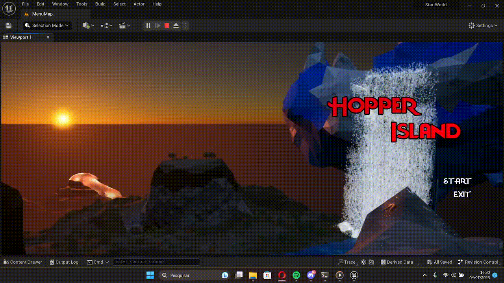

# Computação Gráfica - Projeto Hopper Island

> Repositório para guardar o projeto de tecnologia em computação gráfica da disciplina PCS3539

## 💡 Prosposta

Com o intuito de criar uma experiência inovadora, apresentamos a proposta do nosso projeto: desenvolver uma versão MVP (Produto Mínimo Viável) de um jogo chamado Hopper Island. Inspirado no conceito de mundo aberto e ilhas divididas, assim como o jogo "The Legend of Zelda: Tears of the Kingdom". Composta por três integrantes, nossa equipe trabalhou periodicamente em torno de 6 semanas para criar esse projeto.

## 🚀 Resultado final

- ▶️ Vídeo demonstração:

https://github.com/VanderSant/PCS3539-ComputacaoGrafica/assets/76136276/966fb449-2b08-47e2-a00b-f09ad08630a2

O vídeo pode ser visto no youtube também clicando [aqui](https://www.youtube.com/watch?v=DjlUcATqmLU)

- 🏝️ Ilhas:

    

- 🧑 Interface do Usuário (UI):
    
    
    

## 👨‍💻 Tecnologias envolvidas

- **Game engine: [Unreal Engine](https://www.unrealengine.com/en-US)**
    - Essa game engine foi usada principalmente para a criação de:
        - User Interface (UI)
            - Telas/Mapa/minimapa
            - Vida/Fôlego
        - Mapas e transições
        - Iluminação
        - Gameplay

- **Software de modelagem: [Blender](https://www.blender.org)**
    - Esse software de modelagem foi usado principalmente para:
        - Modelagens
        - Texturização
        - Esqueletos/armadura de personagens

## 📚 Documentação

Acesse toda a documentação do projeto na pasta [Docs](./Docs/). Lá você encontrará o [relatório completo](./Docs/DocumentacaoCompleta.pdf) do jogo e a [apresentação realizada em sala de aula](./Docs/ApresentacaoCompleta.pdf) sobre a Hopper Island.

## 👤 Contribuidores

  <table style="width:100%">
      <tr align="center">
          <td><strong>Caio Gossi</strong></td>
          <td><strong>Roberta Andrade</strong></td>
          <td><strong>Vanderson Santos</strong></td>
      </tr>
      <tr align="center">
          <td>
              
          </td>
          <td>
              
          </td>
          <td>
              
          </td>
      </tr>
      <tr align="center">
          <td>
            
            
          </td>
          <td>
            
            
          </td>
          <td>
            
            
          </td>
      </tr>
  </table>

